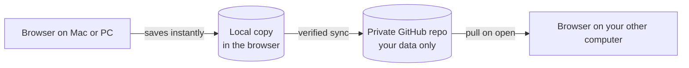

<div align="center">

# Ledger

**A quiet, local-first expense tracker.**
Log it, split it, see where the month went.


</div>

---

## What is Ledger?

Ledger is a personal expense tracker built to replace a spreadsheet. It does the handful of things that paid trackers each do only partly: log expenses, show history, summarize on a dashboard, split costs with named people, and look ahead at your balance.

It runs in the browser, keeps your data on your own device first, and syncs between your computers through a private GitHub repository you own. There is no company server, no account to create, and nothing to subscribe to.

> Built for one person. Designed to feel calm: few words, light mode only, soft glass accents.

---

## What it does

| | Feature | What you get |
|---|---|---|
| **Add** | Fast entry | Amount, currency, category, note, date and account in one small form. |
| **Ledger** | History | Day, Week and Month views, search, edit and delete, and a quiet "Due soon" group for upcoming payments. |
| **Dashboard** | Summary | Spent this month compared with last month, a category donut, daily bars, account balances, and what is still due. |
| **Splits** | Shared costs | Choose who paid and how to split: they owe it all, you owe it all, 50/50, or custom amounts for 3 or more people. |
| **Snapshot** | Easy settling | Turn a person's balance into a clean statement image you can copy or save, then record the settlement. |
| **Currency** | Multi-currency | PHP by default. Foreign expenses keep their original amount and the exchange rate at the time, so history never shifts. |
| **Recurring** | Rules, not rows | One-off, recurring (weekly, monthly, yearly) and installments such as "3 of 12, 8,000 left". Stored once, generated when needed. |
| **Forecast** | Look ahead | Enter your salary per month or repeat it, and see your balance projected 12 months out from income, recurring costs and your average spending. |
| **Sync** | Two computers, one ledger | A verified handoff through a private GitHub repo. It shows when it is synced and only says "Safe to close" after checking. |
| **Backup** | Your data, your files | Export everything as one file or as a spreadsheet, and import a backup. Nothing is deleted on import. |

---

## What it does not do

Ledger stays small on purpose. It does **not**:

- connect to banks or import bank feeds
- scan receipts or read text from photos
- set budgets or savings goals
- support multiple users or shared accounts
- ship a native mobile app
- offer dark mode
- send notifications
- track investments
- store account or card numbers
- run a server, require a login, or cost money

---

## How it works



**Local first.** Every change is saved in your browser right away, so the app works offline. Install it as an app from your browser's menu and it opens offline too.

**Two repositories.** The app code lives in this public repo and is served as a static site. Your data lives in a separate private repo that only you can read. Code and data never mix.

**One writer at a time.** You use one computer at a time, so Ledger treats sync as a handoff, not live merging. On open it checks for newer data and downloads it first. After saving it pushes your changes and confirms they landed before showing "Synced". If both computers changed, you choose which version to keep, or merge them, and the version you did not keep is saved to your Downloads first.

**Plain files.** Data is stored as readable JSON, one file per month, with money kept as whole centavos to avoid rounding errors. Git history doubles as your backup.

---

## Use Ledger yourself

Anyone can have their own Ledger. There is no sign-up, and nothing is shared with the person who built it: each person's data lives in their own browser and their own private GitHub repo.

You can use it two ways.

| | **Use the hosted copy** | **Host your own copy** |
|---|---|---|
| Repos you create | **1**: a private repo for your data | **2**: a fork of this repo for the app, plus a private repo for your data |
| Steps | Open the link, connect your data repo | Fork, switch on Pages, then connect your data repo |
| Who controls the code | The author. Updates reach you automatically. | You. You choose when to update. |
| Trust needed | You run code published by someone else, and that code can see your token in your browser. Use it only with people you trust. | None beyond reading the code yourself. |
| Good for | Trying it, family and friends | Anyone who wants full control |

Hosted copy: **https://seanabasta.github.io/ledger-web-app/**

### Does using someone's hosted copy use up their GitHub limits?

Practically no, and never the parts that matter:

- **Their data and yours are separate.** Your entries go from your browser straight to your own data repo, using your own token. They never pass through the author's repo or account, and your API calls count against your token, not theirs.
- **Site size (1 GB)** is the size of the published app, which is a few hundred kilobytes in total. More users do not make it bigger.
- **Bandwidth (100 GB a month, a soft limit)** is the only thing shared. Opening Ledger downloads roughly 100 KB the first time, and then your browser reuses it, so a single user costs almost nothing. Even a thousand people would be a tiny fraction of the limit.
- **If you host your own copy,** all of this counts against your account instead, and nobody else's.

### Set up your data repo and sync

You need a free GitHub account, and the same steps for either option.

1. Create a **private** repo for your data (any name; a hard-to-guess one is a nice touch), with a README so it has a first commit.
2. On GitHub, go to Settings, Developer settings, Personal access tokens, Fine-grained tokens, and generate a token. Limit it to **that one repo**, give it **Contents: Read and write** only, and set an expiry date.
3. Open Ledger, click the status pill, and choose Connect GitHub. Enter your username, the data repo name and the token.
4. Do the same on your other computer. It pulls everything on first open.

Before you close Ledger, press the status pill, then Sync now, and wait for **Synced. Safe to close.**

When the token is close to expiring, Settings shows a reminder. Create a new one and use Replace token on each computer.

### Host your own copy

1. Fork this repo to your own account. The fork is public, which GitHub Pages needs on a free account. It holds only code, never your data.
2. In your fork, open the Actions tab and enable workflows, since GitHub turns them off on forks by default.
3. In the fork, go to Settings, Pages, and set Source to **GitHub Actions**.
4. Run the "Deploy to GitHub Pages" workflow (or push any change). Your copy appears at `https://<your-username>.github.io/<fork-name>/`.
5. Follow "Set up your data repo and sync" above.

To update later, use "Sync fork" on GitHub and the site redeploys on its own. Your data is untouched by app updates.

---

## Privacy and security

- Your data stays in your browser and in a private repo you control.
- The app has no analytics, no third-party scripts, and a strict Content Security Policy that only allows talking to `api.github.com`.
- The service worker caches only the app's own files, never your data and never requests to GitHub.
- Sync uses a GitHub token limited to the data repo only, stored in your browser. Anyone with access to that browser profile, or any malicious script on the page, could use it, so keep your devices locked.
- A private repo is still stored on GitHub's servers. Do not put anything in Ledger you would not trust to a private repository.
- Never commit tokens or data to this repo. The deploy workflow fails if the build contains something that looks like a token.

---

## Status

Ledger is feature complete for its first version and deployed. Sync has been tested against a simulated GitHub, and the first real-world use is under way.

| Milestone | Scope | Status |
|---|---|---|
| 1 | Project shell, data model, local storage, tests | Done |
| 2 | Add form and Ledger, currency, recurring and installments | Done |
| 3 | Dashboard | Done |
| 4 | Splits and snapshot | Done |
| 5 | Accounts, income and Forecast, Settings | Done |
| 6 | GitHub sync layer | Done |
| 7 | Token setup screen, sync status, conflict screen | Done |
| 8 | Deployment to GitHub Pages, install as an app, export and import | Done |

The app is live at `https://seanabasta.github.io/ledger-web-app/`.

---

## Built with

- **React** and **TypeScript**, bundled with **Vite**
- **IndexedDB** for the local working copy
- **GitHub REST API** (Git Data) for sync
- **GitHub Pages** and **GitHub Actions** for hosting

Built with Claude Code.

---

## Run it locally

You need [Node.js](https://nodejs.org). Then:

```bash
git clone https://github.com/SeanAbasta/ledger-web-app.git
cd ledger-web-app
npm install
npm run dev
```

Open the address the terminal prints, plus the app path: usually `http://localhost:5173/ledger-web-app/`.

Other commands:

```bash
npm test          # run the tests
npm run build     # production build into dist/
npm run preview   # serve the production build locally
```

---

## License

This is a personal project. No license has been chosen yet, so all rights are reserved.
