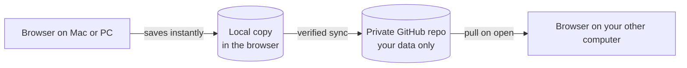

<div align="center">

# Ledger

**A quiet, local-first expense tracker.**
Log it, split it, see where the month went.


</div>

---

## What is Ledger?

Ledger is a personal expense tracker built to replace a spreadsheet. It does the handful of things that paid trackers each do only partly: log expenses, show history, summarize on a dashboard, split costs with named people, and look ahead at your balance.

It runs in the browser, keeps your data on your own device first, and syncs between your computers through a private GitHub repository you own. There is no company server, no account to create, and nothing to subscribe to.

> Built for one person. Designed to feel calm: few words, soft glass accents, light by default with an optional dark mode.

---

## Quick start

Ledger has no company behind it and no shared server, so **you make your own copy of it**. That takes about 15 minutes and costs nothing.

1. **Make your own copy of the app** (a public repo of yours that GitHub Pages serves). [Steps](#1-make-your-own-copy-of-the-app)
2. **Make a private repo for your data**, and a token that can only touch that repo. [Steps](#2-make-your-private-data-repo-and-token)
3. **Connect them** in the app, once per computer. [Steps](#3-connect-your-computers)

After that you only need a browser.

**What you need:** a free [GitHub](https://github.com) account and a modern browser (Chrome, Edge, Safari or Firefox). You do not need to install anything or write code.

---

## What it does

| | Feature | What you get |
|---|---|---|
| **Add** | Fast entry | Amount, currency, category, note, date and account in one small form. |
| **Ledger** | History | Day, Week and Month views, search, edit and delete, and a quiet "Due soon" group for upcoming payments. |
| **Dashboard** | Summary | Spent this month compared with last month, a category donut, daily bars, account balances, and what is still due. |
| **Splits** | Shared costs | Choose who paid and how to split: they owe it all, you owe it all, 50/50, or custom amounts for 3 or more people. |
| **Snapshot** | Easy settling | Turn a person's balance into a clean statement image you can copy or save, then record the settlement. |
| **Currency** | Multi-currency | PHP by default. Foreign expenses keep their original amount and the exchange rate at the time, so history never shifts. |
| **Recurring** | Rules, not rows | One-off, recurring (weekly, monthly, yearly) and installments such as "3 of 12, 8,000 left". Stored once, generated when needed. |
| **Forecast** | Look ahead | Enter your salary per month or repeat it, and see your balance projected 12 months out from income, recurring costs and your average spending. |
| **Sync** | Two computers, one ledger | A verified handoff through a private GitHub repo. It shows when it is synced and only says "Safe to close" after checking. |
| **Appearance** | Light or dark | Light by default. Switch to Dark, or Auto to follow your device, in Settings. It is a per-device choice and is not synced. |
| **Backup** | Your data, your files | Export everything as one file or as a spreadsheet, and import a backup. Nothing is deleted on import. |

---

## What it does not do

Ledger stays small on purpose. It does **not**:

- connect to banks or import bank feeds
- scan receipts or read text from photos
- set budgets or savings goals
- support multiple users or shared accounts
- ship a native mobile app
- send notifications
- track investments
- store account or card numbers
- run a server, require a login, or cost money

---

## How it works



**Local first.** Every change is saved in your browser right away, so the app works offline. Install it as an app from your browser's menu and it opens offline too.

**Two repositories.** The app code lives in this public repo and is served as a static site. Your data lives in a separate private repo that only you can read. Code and data never mix.

**One writer at a time.** You use one computer at a time, so Ledger treats sync as a handoff, not live merging. On open it checks for newer data and downloads it first. After saving it pushes your changes and confirms they landed before showing "Synced". If both computers changed, you choose which version to keep, or merge them, and the version you did not keep is saved to your Downloads first.

**Plain files.** Data is stored as readable JSON, one file per month, with money kept as whole centavos to avoid rounding errors. Git history doubles as your backup.

---

## Make your own Ledger

Each person runs their own copy, with their own two GitHub repos. Nothing is shared with the author or with anyone else, and each person's data lives only in their own browser and their own private repo.

| Repo | Visibility | What it holds |
|---|---|---|
| **App** (your copy of this project) | Public | Code only. GitHub Pages needs a public repo on a free account. It never holds your data. |
| **Data** (yours alone) | **Private** | Your expenses, as small JSON files. |

> The author's own copy is live at https://seanabasta.github.io/ledger-web-app/ as a personal instance. Please make your own copy instead of using it: that way you decide what code runs with your token, and updates happen when you choose.

### 1. Make your own copy of the app

The easiest way is a fork, which needs no command line.

1. Sign in to GitHub and click **Fork** at the top of this page. Keep the name or choose your own.
2. In your fork, open the **Actions** tab and click the green button to enable workflows. GitHub turns them off on forks by default.
3. In your fork, go to **Settings, then Pages**, and set **Source** to **GitHub Actions**.
4. Back in the **Actions** tab, open **Deploy to GitHub Pages** and click **Run workflow**. When it turns green your app is live at `https://<your-username>.github.io/<your-fork-name>/`. Bookmark it.

<details>
<summary>Prefer the command line? Make a clean copy instead of a fork</summary>

Create an empty public repo on GitHub, then:

```bash
git clone https://github.com/SeanAbasta/ledger-web-app.git my-ledger
cd my-ledger
git remote set-url origin https://github.com/<your-username>/<your-repo>.git
git push -u origin main
```

Then do steps 2 to 4 above (enable Actions if asked, set Pages to GitHub Actions, run the workflow).

</details>

### 2. Make your private data repo and token

1. Create a new **private** repo for your data. Any name works, and a hard-to-guess one is a nice touch. Tick "Add a README" so it has a first commit.
2. On GitHub go to **Settings, Developer settings, Personal access tokens, Fine-grained tokens, Generate new token**.
3. Resource owner: you. **Expiration:** a date within a year, and write it down.
4. Repository access: **Only select repositories**, and choose **only your data repo**.
5. Permissions: **Contents: Read and write**. Nothing else.
6. Generate the token and copy it once. You cannot see it again.

### 3. Connect your computers

1. Open your app link, click the status pill in the top corner (it says "Set up sync"), then **Connect GitHub**.
2. Enter your GitHub username, your data repo name, the token and its expiry date, then **Verify**.
3. Do the same on your other computer. It downloads everything on first open.

That is all. Add expenses as normal and Ledger pushes them to your data repo a few seconds after each change.

### Every day

1. Open Ledger and wait for "Checking for updates…" to finish and the pill to say **Synced**.
2. Work as usual.
3. Before closing, click the pill, press **Sync now**, and wait for **Synced. Safe to close.** Then close the tab. Then use your other computer the same way.

### Keeping your copy up to date

Your copy does not update by itself. When the author releases bug fixes or new features, **update your copy to get them**:

- **Forked:** on your fork's page, click **Sync fork, then Update branch**. The site rebuilds and redeploys on its own in about a minute.
- **Cloned:** re-clone the project, or pull the new changes into your copy, then push to your repo.

Then reload the app (and accept the update if you installed it as an app). An update only replaces the app's code. It does not change your data repo or your browser's copy. If a release ever has to change how data is stored, the release notes will say what to do.

### Will my copy use the author's GitHub limits?

No. Your copy is your own repo on your own account, so its site size, bandwidth and build limits are yours. Your data goes from your browser to your private repo using your own token, so it counts against your own API limits. For one person this is nowhere near any limit: the app is a few hundred kilobytes, and a month of entries is tens of kilobytes.

### When something goes wrong

| What you see | What it means | What to do |
|---|---|---|
| **Token expired** | The token reached its expiry date, or was revoked. | Create a new token (step 2), then Settings, **Replace token**, on each computer. Your data is safe on the device meanwhile. |
| **Two versions** | Both computers changed since they last synced. | Pick Keep this device, Keep remote, or Merge. The version you do not keep is saved to your Downloads first. |
| **Offline, read-only** | No connection. Ledger holds back edits so your other computer's data stays safe. | Reconnect and press Retry, or choose Edit offline if you are sure. |
| **Needs sync** that does not clear | A push failed (rate limit, network). | Click the pill, then Sync now. It retries by itself too. |
| **No access to the data repo** | The token cannot reach that repo. | Check the repo name, and that the token is limited to that repo with Contents read and write. |
| **Pages shows a 404** | Pages is not on yet. | Settings, Pages, Source: GitHub Actions, then run the workflow again. |
| **Workflow will not run on a fork** | GitHub disables Actions on forks. | Open the Actions tab and enable workflows. |
| **Browser data cleared** | Ledger's local copy is gone. | Open Ledger and it downloads everything again from your data repo, or use Settings, **Import** with a backup file. |

Back up now and then with Settings, **Backup file**. The data repo's history is a backup too: GitHub keeps every earlier version.

---

## Privacy and security

- Your data stays in your browser and in a private repo you control.
- The app has no analytics, no third-party scripts, and a strict Content Security Policy that only allows talking to `api.github.com`.
- The service worker caches only the app's own files, never your data and never requests to GitHub.
- Sync uses a GitHub token limited to the data repo only, stored in your browser. Anyone with access to that browser profile, or any malicious script on the page, could use it, so keep your devices locked.
- A private repo is still stored on GitHub's servers. Do not put anything in Ledger you would not trust to a private repository.
- Never commit tokens or data to this repo. The deploy workflow fails if the build contains something that looks like a token.

---

## Status

Ledger is feature complete for its first version and deployed. Sync has been confirmed against a real GitHub repo from one computer; the full two-computer handoff is still being tried out, so expect rough edges and keep a backup.

| Milestone | Scope | Status |
|---|---|---|
| 1 | Project shell, data model, local storage, tests | Done |
| 2 | Add form and Ledger, currency, recurring and installments | Done |
| 3 | Dashboard | Done |
| 4 | Splits and snapshot | Done |
| 5 | Accounts, income and Forecast, Settings | Done |
| 6 | GitHub sync layer | Done |
| 7 | Token setup screen, sync status, conflict screen | Done |
| 8 | Deployment to GitHub Pages, install as an app, export and import | Done |

The author's own copy is live at `https://seanabasta.github.io/ledger-web-app/`.

---

## Built with

- **React** and **TypeScript**, bundled with **Vite**
- **IndexedDB** for the local working copy
- **GitHub REST API** (Git Data) for sync
- **GitHub Pages** and **GitHub Actions** for hosting

Built with Claude Code.

---

## Run it locally (for developers)

You do not need this to use Ledger. It is for changing the code. You need [Node.js](https://nodejs.org). Then:

```bash
git clone https://github.com/SeanAbasta/ledger-web-app.git
cd ledger-web-app
npm install
npm run dev
```

Open the address the terminal prints, plus the app path: usually `http://localhost:5173/ledger-web-app/`.

Other commands:

```bash
npm test          # run the tests
npm run build     # production build into dist/
npm run preview   # serve the production build locally
```

---

## License

This is a personal project. No license has been chosen yet, so all rights are reserved.
